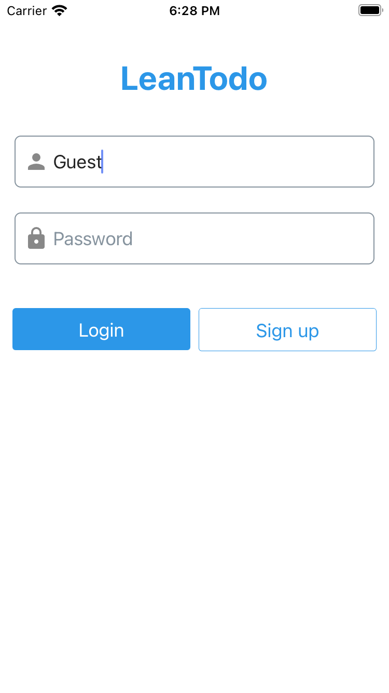
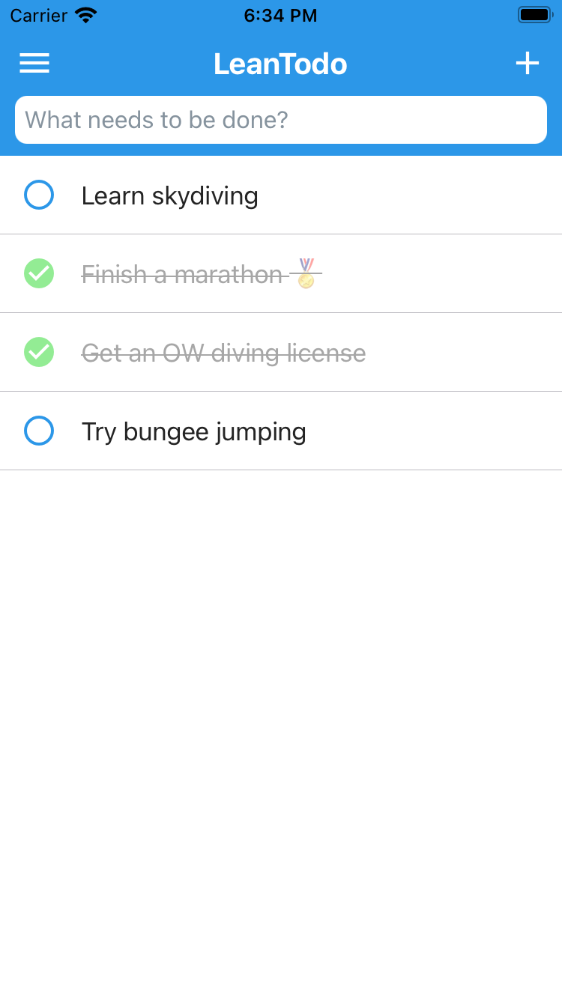
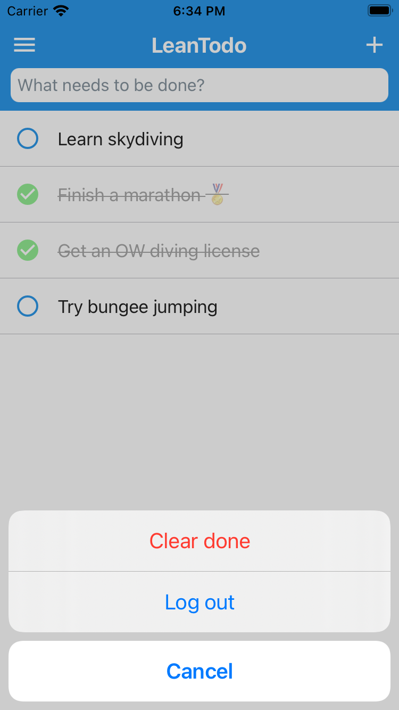
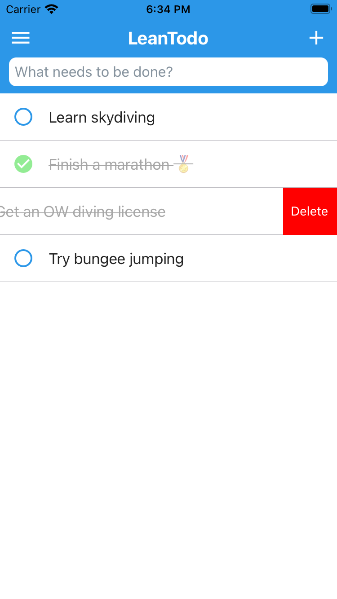

LeanTodo
====

LeanTodo 是使用 [LeanCloud Storage](https://leancloud.cn/docs/storage_overview.html) 与 [React Native](https://reactnative.dev/) 构建的 Todo 应用程序，支持 iOS 与 Android。

LeanTodo App 与 [LeanTodo Vue](https://leancloud.github.io/leantodo-vue/) ([source](https://github.com/leancloud/leantodo-vue/)) 使用同一个 appid，数据是互通的。

## 本地运行

1. 按照 [React Native 文档](https://reactnative.dev/docs/getting-started.html) 搭建开发环境。
2. clone 本项目。
3. `npm install`。
4. 编译运行 LeanTodo 的 iOS 与 Android App（参考步骤 1）。

## 运行截图

